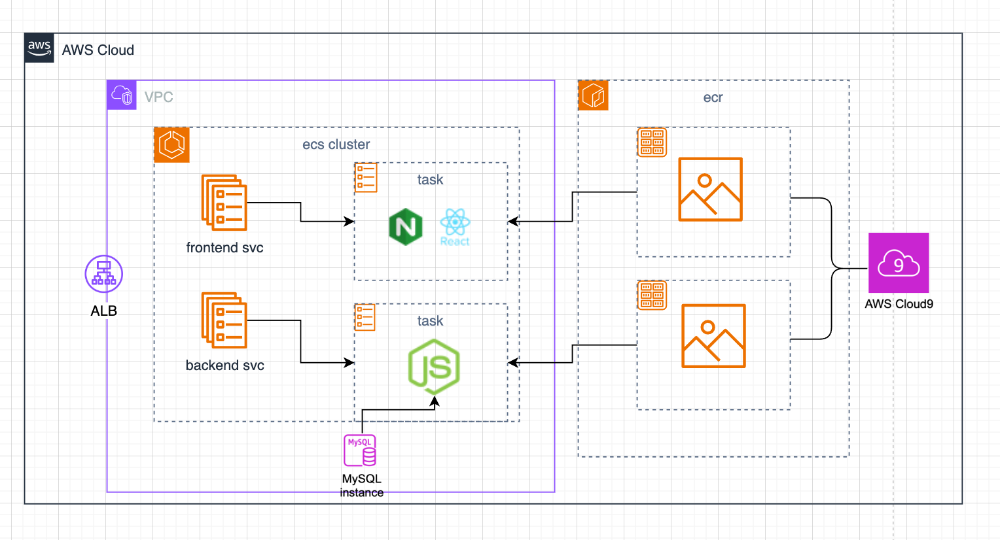

# **중규모 아키텍처(ecs)**

### **아키텍처 그림**



### **개요**

생성된 서비스 역할 및 인스턴스 프로파일은 AWS CLI를 통해 생성된 모든 추가 EC2 환경에 재사용할 수 있습니다. 이를 위해 다음 AWS CLI 명령어를 실행하여 서비스 역할 및 인스턴스 프로파일을 생성합니다.

cloud9를 통해서 프론트엔드,백앤드서버를 ecr에 빌드후 올려주기 위해서 롤을 aws-cli를 통해서 만들어준다.

AWS CLI를 사용하여 **Systems Manager**의 인스턴스 프로파일을 관리하고, 수신되지 않는 EC2 환경을 생성할 수 있습니다. 이때 `create-environment-ec2` 명령어에서 `--connection-type` 옵션을 `CONNECT_SSM`으로 설정합니다.

해당 옵션을 사용하면 **AWSCloud9SSMAccessRole** 서비스 역할 및 **AWSCloud9SSMInstanceProfile**이 자동으로 생성되지 않습니다. 필요한 서비스 프로파일과 인스턴스 프로파일을 수동으로 생성하려면 다음 중 하나를 수행해야 합니다.

```bash
aws iam create-role --role-name AWSCloud9SSMAccessRole --path /service-role/ --assume-role-policy-document '{"Version": "2012-10-17","Statement": [{"Effect": "Allow","Principal": {"Service": ["ec2.amazonaws.com","cloud9.amazonaws.com"]},"Action": "sts:AssumeRole"}]}'

aws iam attach-role-policy --role-name AWSCloud9SSMAccessRole --policy-arn arn:aws:iam::aws:policy/AWSCloud9SSMInstanceProfile

aws iam create-instance-profile --instance-profile-name AWSCloud9SSMInstanceProfile --path /cloud9/

aws iam add-role-to-instance-profile --instance-profile-name AWSCloud9SSMInstanceProfile --role-name AWSCloud9SSMAccessRole
```

#### **클러스터 설정**

- 클러스터 이름: (예시: MyEcsCluster)
- 기본 네임스페이스: (MyEcsCluster) - 자동으로 클러스터네임이 네임스페이스가 된다.

#### **인프라 설정**

- **EC2 인스턴스**

  > fargate는 서버리스 방식으로 컨테이너를 관리할 필요 없이 태스크 단위로 리소스를 자동 할당받아 사용할 수 있어 관리 오버헤드가 적다
  > 하지만 프리티어 ec2인스턴스를 사용을 위해 fargate(serverless)대신에 아마존인스턴스를 사용했다.

  - **Auto Scaling Group**: 자동 확장 그룹 설정
  - **프로비저닝 모델**: 온디맨드(On-Demand)
  - **운영 체제**: Amazon Linux 2 (Kernel 5.10)
  - **인스턴스 타입**: c5.large
  - **Desired Capacity**:
    - 최소: 0
    - 최대: 2
  - **SSH 키 페어**: (키 페어 정보)
  - **EBS 루트 볼륨 크기**: 30GB

- **모니터링 설정**
  - **Container Insights**: 비활성화

### **태스크 정의 구성**

- **태스크 정의 패밀리**: (예시: MyTaskDefinition)
- **인프라 요구 사항**:
  - **런치 타입**: AWS Fargate, EC2 인스턴스
  - **운영 체제/아키텍처**: Linux/x86_64
  - **네트워크 모드**: awsvpc, bridge, default, host, none
  - **태스크 크기**:
    - CPU: 1vCPU
    - 메모리: 3GB

### **서비스 설정**

- **컴퓨트 구성**
  - **용량 제공자 전략**: 기본 제공자 사용
  - **배포 설정**:
    - 애플리케이션 유형: (애플리케이션 정보)
    - 서비스 유형: Replica 또는 Daemon
    - 원하는 태스크 수: 1
  - **배포 실패 감지**:
    - Amazon ECS 배포 회로 차단기 사용
    - 실패 시 롤백 활성화

### **네트워크 설정**

- **ELB 인바운드 포트**: 80, 3333
- **RDS 포트**: (포트 정보)
