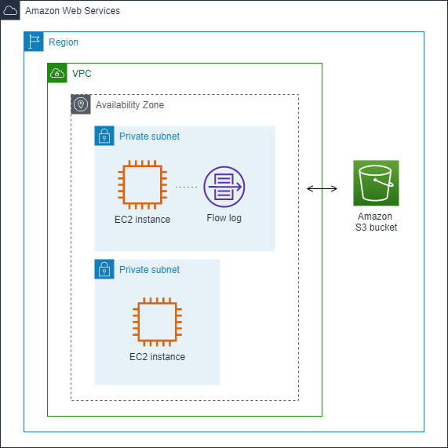
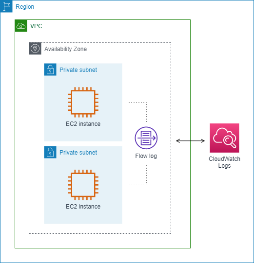

### Loggin IP traffic using VPC Flow Logs

VPC flow log는 VPC의 네트워크 인터페이스에서 들어오고 나가는 IP 트래픽에 대한 정보를 캡처할 수 있는 기능입니다. flow log 데이터는 Amazon CloudWatch Logs, Amazon S3 또는 Amazon Data Firehose 위치에 게시할 수 있습니다. flow log를 생성한 후에는 구성한 로그 그룹, 버킷 또는 전송 스트림에서 flow log 레코드를 검색하고 볼 수 있습니다.

flow log는 다음과 같은 다양한 작업에 도움이 될 수 있습니다.

- 지나치게 제한적인 보안 그룹 규칙 진단

- 인스턴스에 도달하는 트래픽 모니터링

- 네트워크 인터페이스로 들어오고 나가는 트래픽 방향 결정

flow log 데이터는 네트워크 트래픽 경로 외부에서 수집되므로 네트워크 처리량이나 대기 시간에 영향을 주지 않습니다. 네트워크 성능에 영향을 미칠 위험 없이 flow log를 생성하거나 삭제할 수 있습니다.

## Flow logs basisc

VPC, 서브넷 또는 네트워크 인터페이스에 대한 flow log를 생성할 수 있습니다. 서브넷 또는 VPC에 대한 flow log를 생성하면 해당 서브넷 또는 VPC의 각 네트워크 인터페이스가 모니터링됩니다.

모니터링되는 네트워크 인터페이스에 대한 flow log 데이터는 트래픽 흐름을 설명하는 필드로 구성된 로그 이벤트인 flow log 레코드로 기록됩니다.

flow log를 생성할때 지정 헤애되는.

flow log를 생성할 리소스

캡처할 트래픽 유형(허용된 트래픽, 거부된 트래픽 또는 모든 트래픽)

flow log 데이터를 게시하려는 대상

다음 예에서는 프라이빗 서브넷의 EC2 인스턴스 중 하나에 대한 네트워크 인터페이스에 대해 허용된 트래픽을 캡처하고 흐름 로그 레코드를 Amazon S3 버킷에 게시하는 flow log를 생성합니다.

다음 예에서 flow log는 서브넷의 모든 트래픽을 캡처하고 flow log 레코드를 Amazon CloudWatch Logs에 게시합니다. flow log는 서브넷의 모든 네트워크 인터페이스에 대한 트래픽을 캡처합니다.

flow log를 생성한 후 데이터 수집을 시작하고 선택한 대상에 게시하는 데 몇 분 정도 걸릴 수 있습니다. flow log는 네트워크 인터페이스에 대한 실시간 로그 스트림을 캡처하지 않습니다.

서브넷 또는 VPC에 대한 flow log를 생성한 후 서브넷으로 인스턴스를 시작하면 네트워크가 있는 즉시 새 네트워크 인터페이스에 대한 로그 스트림(CloudWatch Logs용) 또는 로그 파일 객체(Amazon S3용)가 생성됩니다. 네트워크 인터페이스의 트래픽입니다.

다음과 같은 다른 AWS 서비스에서 생성된 네트워크 인터페이스에 대한 flow log를 생성할 수 있습니다.

- Elastic Load Balancing

- Amazon RDS

- Amazon ElastiCache

- Amazon Redshift

- Amazon WorkSpaces

- NAT gateways

- Transit gateways

네트워크 인터페이스 유형에 관계없이 Amazon EC2 콘솔 또는 Amazon EC2 API를 사용하여 네트워크 인터페이스에 대한 flow log를 생성해야 합니다.

flow log에 태그를 적용할 수 있습니다. 각 태그는 키와 선택적 값으로 구성됩니다. 둘 다 정의하다. 태그는 목적이나 소유자 등을 기준으로 flow log를 구성하는 데 도움이 됩니다.

flow log가 더 이상 필요하지 않으면 삭제할 수 있습니다. flow log를 삭제하면 리소스에 대한 flow log 서비스가 비활성화되므로 새 flow log 레코드가 생성되거나 게시되지 않습니다. flow log를 삭제해도 기존 flow log 데이터는 삭제되지 않습니다. flow log를 삭제한 후 작업이 끝나면 대상에서 직접 flow log 데이터를 삭제할 수 있습니다.

> https://docs.aws.amazon.com/ko_kr/athena/latest/ug/vpc-flow-logs-create-table-statement.html  
> https://docs.aws.amazon.com/vpc/latest/userguide/flow-logs.html
